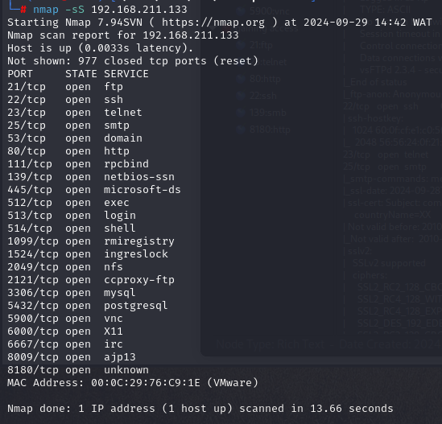
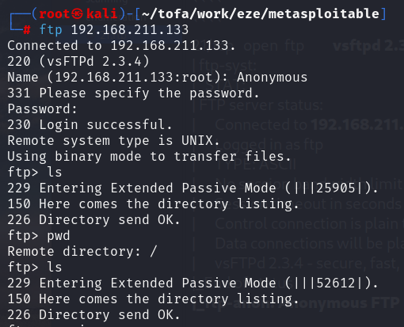
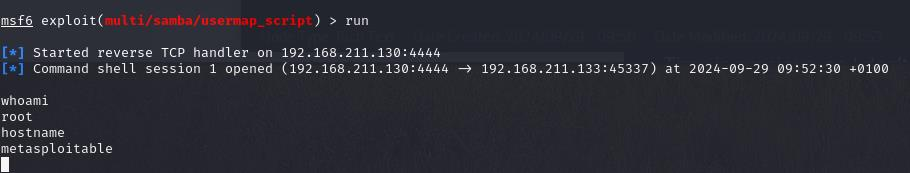
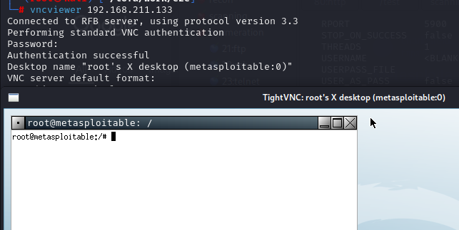

# Chester Ltd Penetration Testing Assessment

## Overview

This project documents a full penetration testing assessment conducted against a vulnerable lab environment simulating Chester Ltd’s infrastructure using Metasploitable2.

The assessment focused on identifying vulnerabilities, validating security weaknesses through exploitation, and providing remediation recommendations based on industry best practices.

---

## Objectives

- Perform reconnaissance and enumeration
- Identify exposed services and vulnerabilities
- Exploit vulnerable services
- Demonstrate privilege escalation
- Conduct post-exploitation activities
- Provide remediation recommendations

---

## Scope

| Target | Details |
|---|---|
| Target Machine | Metasploitable2 |
| Operating System | Linux |
| Target IP | 192.168.211.133 |

---

## Skills Demonstrated

- Network Reconnaissance
- Nmap Enumeration
- Vulnerability Assessment
- Exploitation with Metasploit
- SMB Exploitation
- FTP Exploitation
- SSH Access & Privilege Escalation
- Password Cracking with JohnTheRipper
- Risk Analysis & Reporting
- Security Documentation

---

## Tools Used

- Nmap
- Metasploit Framework
- Nikto
- JohnTheRipper
- Linux Terminal
- FTP
- SSH
- Telnet

---

## Key Vulnerabilities Identified

| Service | Vulnerability | Severity |
|---|---|---|
| FTP | vsftpd 2.3.4 Backdoor (CVE-2011-2523) | Critical |
| SMB | Samba usermap_script RCE (CVE-2007-2447) | Critical |
| SSH | Default Credentials | High |
| Telnet | Plaintext Authentication | High |
| VNC | Weak Password | High |
| HTTP | Information Disclosure | Medium |

---

## Exploitation Highlights

### FTP Exploitation
- Identified vulnerable vsftpd 2.3.4 service
- Exploited backdoor vulnerability
- Obtained root shell access

### SMB Exploitation
- Exploited Samba usermap_script vulnerability
- Achieved full system compromise

### Password Cracking
- Extracted password hashes from `/etc/shadow`
- Cracked multiple hashes using JohnTheRipper

---

## Screenshots

### Nmap Enumeration

### FTP Exploitation

### Samba Exploitation

### Root Shell Access

---

## Risk Assessment

The assessment revealed multiple critical vulnerabilities capable of leading to full system compromise.

Primary risks included:
- Remote code execution
- Privilege escalation
- Credential exposure
- Weak authentication
- Information disclosure

---

## Recommendations

- Patch outdated services
- Disable insecure protocols (Telnet/FTP)
- Enforce strong password policies
- Secure remote access services
- Conduct regular vulnerability assessments
- Implement log monitoring

---

## Ethical Disclaimer

This project was conducted in a controlled lab environment for educational and ethical security research purposes only.

---

## References

- Nmap Project
- Offensive Security
- Rapid7 Vulnerability Database
- CVE Details
